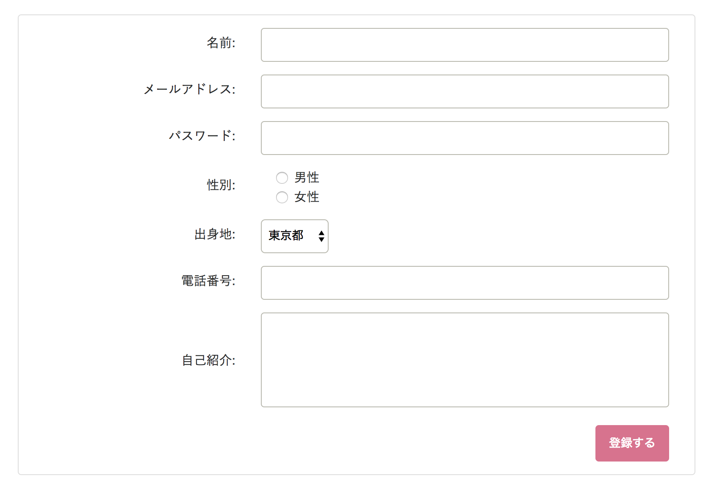

# チャレンジ9

```
所要時間: 30分〜1時間
ステータス: 公開
タイプ: 課題
```

## 目的

- フォームの各要素を使ってみる
- リスポンシブ対応のフォームを作成する

## チャレンジの取り組み方

1. マイルストーンごとに要件に合うようにファイルを編集していきます。
2. 分からない部分があれば、テキストを復習して、再度チャレンジしてみましょう。
3. 再チャレンジしてしばらく考えても分からない場合はチャットでメンターに質問しましょう。
4. 完成したら、Dropboxでメンターとファイルを共有して下さい。
5. メンターから課題レビューが届きます。
6. ビデオチャットの際は、分からない点を更に突っ込んで聞いたり、より良い書き方を聞いてみましょう。

## 概要

レッスン9ではフォーム要素の利用方法を解説しました。このチャレンジでは学んだ要素を利用して参考画像のようなレスポンシブ対応フォームを作成してみましょう。



## スターターファイル

以下のURLのコードをテンプレートとして利用して下さい。

- [codegrit-html-css-ch07-starter](https://github.com/codegrit-jp-students/codegrit-html-css-ch09-starter)

## マイルストーン

### 要件

- スターターファイルで既に定義されたグリッドを利用して、画面サイズが大きな場合はラベルとインプット要素を一行に表示し、画面サイズが小さい場合はラベルとインプットを別行で表示するフォームを作成します。
- textarea、radio、select、inputを全て利用して下さい。
- フォームを作成するだけでなく要素にCSSを適用して見栄えを整えましょう。
- 提出用ボタンを画面下部に表示します。ボタンであることが分かりやすいようホバーすると色が変わるようにしましょう。
- 提出用ボタンは画面が大きい場合は右側寄せで表示し、小さい場合は左寄せで表示しましょう。

### ヒント

- flexboxの`align-items`プロパティを利用するとラベルとインプットの縦ラインでの中央寄せを簡単に出来ます。
- `input[type=checkbox]`のように要素を指定してCSSを設定することが出来ます。


## 評価

課題の後、以下の２つについてメンターにフィードバックをお願いします。

1. 要件のカバー度: 1.全く出来なかった 2.ほとんど出来なかった 3. 半分ほどは出来た 4.8割ほどは出来た 5. 全部出来た
2. 難易度: 1. とても難しかった 2. 難しかった 3. ちょうど良かった 4. 簡単だった 5. とても簡単だった
