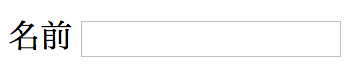
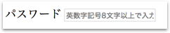
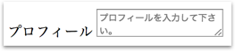
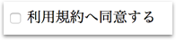
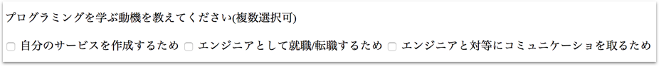
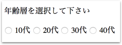
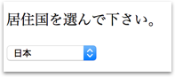

## はじめに

サイトへのユーザー登録や、お問合せなどウェブを利用していると多くの場面でHTMLフォームを利用する場面があります。今回のレッスンではこのHTMLフォームを自分で作成する方法、またデザインのカスタマイズ方法、裏側では何が起っているのかなどフォームの基本を説明していきます。

## フォームの作成方法

HTMLフォームを作成するには`form`要素を利用します。

```html
<form>
  ...
</form>
```

## label要素

ラベルは、入力する項目が何かをユーザーに示すために利用します。例えば、ユーザー登録フォームの多くではメールアドレスを要求します。この場合、以下の例のように書きます。

```html
<label for="email">メールアドレス</label>
```

セマンティクスHTMLでは上記の例のように`for`属性を利用して、そのラベルがメールアドレスのためであることを明示することが推奨されています。`for`には任意の値を与えることが出来ますので`for=mail`、`for=first-name`、`for=password`など分かりやすい名前を入力しましょう。

## input要素

フォームではユーザーにテキストを入力してもらったり、複数の選択肢から一つを選んでもらうなどしてもらいますが、この時に`textarea`要素など独自の要素を使う場合と、`<input>`要素を利用し、type属性でフォームのタイプを変更する場合との2つがあります。`input`要素のシンタックスは以下の通りです。

```html
<input type="type" ...>
```

## テキストインプット

input要素の中で最もよく使うのがテキストインプットです。例えば、ユーザーに名前を入力してもらいたい場合は以下のように書きます。

```html
<label for="name">名前</label>
<input type="text" name="name">
```



[サンプルコード](https://github.com/codegrit-jp-students/codegrit-html-css-lesson09-samples/blob/master/text-input1.html)

### type属性

上記の例で、type属性には`"text"`と入っています。テキストを入力するタイプのinput要素のtype属性にはこの他にも、以下のようなものがあります。セマンティクスHTMLでは、フォーム入力情報の種類に併せて適切な`type`属性を指定することを推奨しています。

- password: パスワード入力欄に利用します。。ほとんどのブラウザでは`type="password"`が指定されている場合、入力情報を`*`へと変換してくれます。
- email: メールアドレス入力欄に利用します。
- search: 検索用テキストの入力欄に利用します。
- url: URLの入力欄に利用します。
- tel: 電話番号の入力欄に利用します。

### placeholder属性

フォームを入力する際に、入力欄の中に注意書きなどを書きたい場合があります。例えばパスワードでよくあるのが、一定文字以上の入力が必要だったり、記号を必須とするケースです。こうした時には`placeholder属性`を利用します。

```html
<label for="password">パスワード</label>
<input type="password" name="name" placeholder="英数字記号8文字以上で入力して下さい">
```



[サンプルコード](https://github.com/codegrit-jp-students/codegrit-html-css-lesson09-samples/blob/master/text-input2.html)

上記の画像のようにInput欄の長さを調整しないと途中で切れてしまうので注意してください。

### name属性

フォームで入力されたデータが何を示すのかを判断するために`name属性`が必要です。`label`要素の`for`属性同様に任意の名前を付けられます。

## テキストエリア要素

テキストエリア要素は、文章を入力するために利用します。よく使うのはユーザーにプロフィールを入力してもらう時や、お問合せフォームの内容を書いてもらうときです。input要素とは異なり終了タグが必要ですので注意して下さい。input要素と同様に`placeholder属性`を設定することが可能です。

```html
<label for="bio">プロフィール</label>
<textarea name="bio" placeholder="プロフィールを入力して下さい。"></textarea>
```



[サンプルコード](https://github.com/codegrit-jp-students/codegrit-html-css-lesson09-samples/blob/master/textarea.html)

## チェックボックス

`input`要素の`type`属性に"checkbox"を指定することでチェックボックスを作成出来ます。

チェックボックスが使われるパターンは2つあります、1つは利用規約への同意やメルマガ配信希望への同意など、1つの質問に対してオン、オフを選んでもらいたい場合です。もう一つは一つの質問に対して複数の選択肢の中から当てはまるものを全て選んで欲しい場合です。以下に2つのパターンそれぞれ例を挙げます。

1. 1つの質問に対して利用する場合

```html
<input type="checkbox" name="terms"><label for="terms">利用規約へ同意する</label>
```



[サンプルコード](https://github.com/codegrit-jp-students/codegrit-html-css-lesson09-samples/blob/master/checkbox1.html)

2. 複数の選択肢で当てはまるもの全て選択

```html
<p>プログラミングを学ぶ動機を教えてください(複数選択可)</p>
<input type="checkbox" name="reasons" id="service"><label for="service">自分のサービスを作成するため</label>
<input type="checkbox" name="reasons" id="job"><label for="job">エンジニアとして就職/転職するため</label>
<input type="checkbox" name="reasons" id="communication"><label for="communication">エンジニアと対等にコミュニケーショを取るため</label>
...
```



[サンプルコード](https://github.com/codegrit-jp-students/codegrit-html-css-lesson09-samples/blob/master/checkbox2.html)

 さて上記の複数選択の例では、`name`属性と`id`属性の2つを利用しました。`name`には、reasonsと入れて、他の選択肢が同じ質問に対するチェックボックスであることを明確にしています。加えてid属性を利用してそれぞれの項目の内容を明確にしています。

## ラジオボタン

`input`要素の`type`属性に"radio"を指定することでチェックボックスを作成出来ます。  ラジオボタンは複数選択肢の中から一つだけを選択肢てもらいたい場合に利用します。以下はユーザーの年代を知りたい場合の例です。

```html
<p>年齢層を選択して下さい</p>
<input type="radio" name="age-group" id="age-10s"><label for="age-10s">10代</label>
<input type="radio" name="age-group" id="age-20s"><label for="age-20s">20代</label>
<label for="age-30s">30代</label>
<input type="radio" name="age-group"id="age-40s">
<label for="age-30s">40代</label>
...
```



[サンプルコード](https://github.com/codegrit-jp-students/codegrit-html-css-lesson09-samples/blob/master/radio1.html)

## セレクト

`select`属性を利用することでセレクトを作成出来ます。セレクトは複数選択肢の中から一つを選んで貰いたい場合に利用します。ラジオボタンと同一の利用方法です。では、どう使い分けるのかというと、セレクトフォームは複数の選択肢を1行に全部含めたい場合や選択肢の数が多く、全部をラジオボタンで書くと冗長になってしまう場合に使います。よく使う場面は例えば出身国や県を選んでもらいたい場合です。選択肢を作成するには`option`要素を利用します。

以下に例を挙げます。

```html
<p>居住国を選んで下さい。</p>
<select name="country">
  <option value="japan">日本</option>
  <option value="usa">アメリカ合衆国</option>
  <option value="canada">カナダ</option>
  <option value="china">中国</option>
  ...
</select>
```



[サンプルコード](https://github.com/codegrit-jp-students/codegrit-html-css-lesson09-samples/blob/master/select1.html)

さて、ここで注目をしていただきたいのは、`value`属性です。この属性はフォームを提出する際にどのオプションが選ばれたのかを知るために利用します。このvalueは、セレクトだけではなく、他の`input`要素などでも利用するので、後ほど「フォーム提出の仕組み」の項目で詳しく説明していきます。

## 提出ボタン

フォームに情報を入力してもらった後、最終的にユーザーにそのデータを提出してもらう必要があります。この時に多くの場合ボタンを利用します。`form`要素の中で使われるボタンには他の要素と同様に`type`属性を指定します。この`type`属性には以下の3つが入ります。

- submit: 一般的に使われるのが`submit`です。フォームデータを送信するために利用します。
- reset: リセットボタンはフォームの入力内容をリセットするために利用します。以前はよく使われていましたが、最近では提出ボタンと誤ってクリックするケースを避けるため使わないことが多いです。
- button: このタイプのボタンは何もしません。このボタンはボタンとJavascriptとを連動させて連動させて何かを行いたい場合に利用します。

```html
<button type="submit">登録する</button>
```