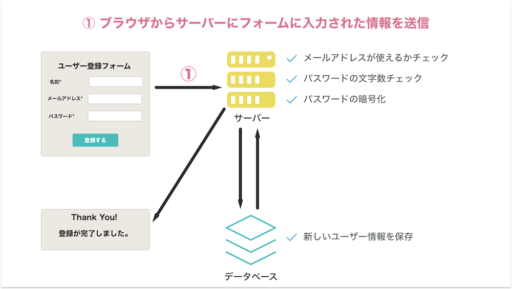
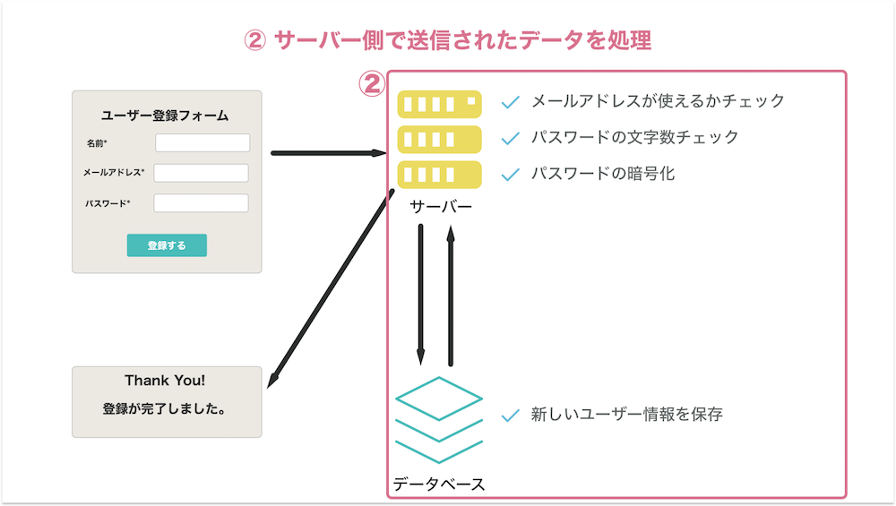
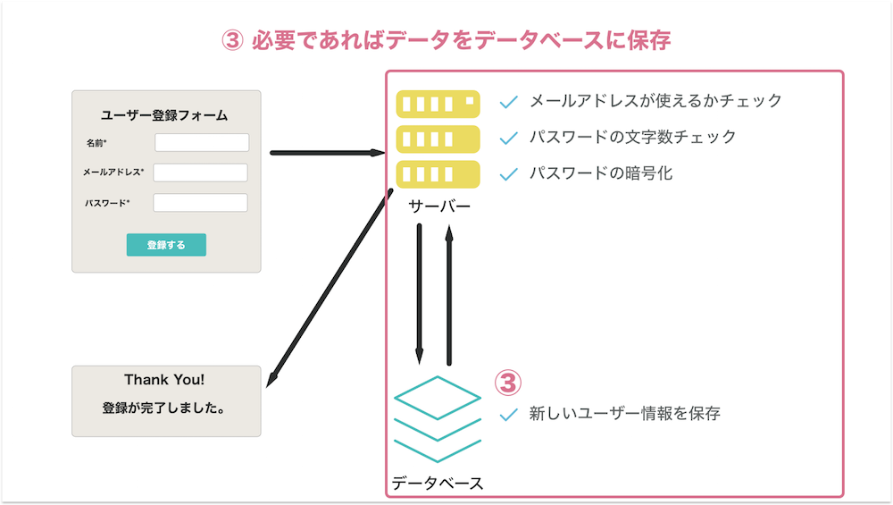
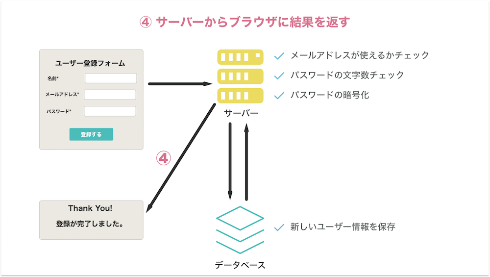
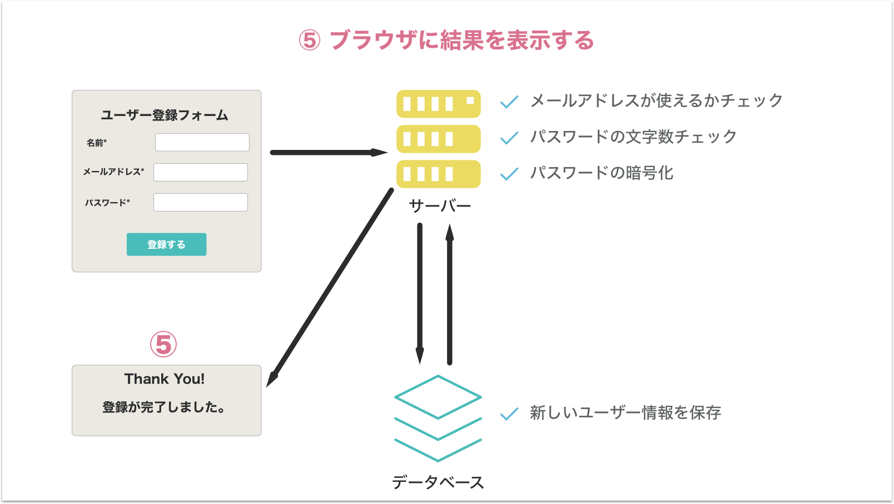

## フォーム提出の仕組み

さて、ここまでHTMLフォームを作成する方法を説明してきました。ではフォームを提出した時には裏側では何が起っているのでしょうか。ここではその仕組について詳しく見ていきましょう。

### 1. ブラウザからサーバーにデータを送信

フォームを提出するとフォームに入力されたデータがインターネットを通じてサーバー上のあるURLへと送信されます。



### 2. サーバー側でフォームのデータを処理

サーバー側では例えば、ユーザー登録であれば同じ名前で登録されたユーザーはいないかのチェックなど様々な処理を行います。



### 3. 必要ならデータを保存する

サーバー側でデータを処理した後、必要であればそのデータをデータベースに保存します。



### 4. サーバーからブラウザに結果を返す

無事に処理が完了した際には成功を意味する`200`というコードを返し、処理が失敗してしまったときはエラーの内容を意味するエラーコード(例えば`404`はページが見つからないことを意味する)を返します。



### 5. ブラウザで結果を表示

例えば、成功だったら「ユーザー登録ありがとうございます」というような表示を行い、失敗なら「エラーが発生しました」と表示します。



## データの送信

### form要素のaction属性とmethod属性

フォームの提出ボタンをクリックした時にブラウザではどのようなデータをどこに送信するのか、また送信は何のために行うのかを知っている必要があります。このどこに送信するかと、何のために送信するのかは、form要素の`action`属性と`method`属性に定義します。

```html
<form action="https://www.example2.com/users/create" method="post">
...
</form>
```

### action属性

action属性には、送信先のURLを指定します。

### method属性

method属性には`post`、`get`のいずれかのメソッドを指定します。postの場合はデータを保存したい時、getの場合はデータを取得したい時に利用します。

### 送信されるデータ

データは各インプットのnameを基に送信されます。例えば以下のフォームを考えてみましょう。

```html
<form action="/somewhere" method="post">
  <div>
    <label for="name">名前</lable>
    <input type="text" name="user-name">
  </div>
  <div>
    <label for="email">メールアドレス</label>
    <iput type="email" name="user-email">
  </div>
</form>
```

すると送信時には、以下のように情報が送信されます。

```
user-name="入力された名前"
user-email="入力されたメールアドレス"
```

## fieldset要素とlegend要素

さて、上記の送信されるデータの例では、各inputを

`div`要素で囲みました。しかしセマンティクスHTMLではここに`fieldset`要素を利用します。また、`label`属性には単語のみを書きますが、より長く項目の説明を書きたい場合`legend要素`を利用することが出来ます。以下に例を挙げます。


```html
<form action="/somewhere" method="post">
  <fieldset>
    <legend>名前を全角で入力してください。</legend>
    <label for="name">名前</lable>
    <input type="text" name="user-name">;
  </fieldset>
  <fieldset>
    <legend>;よく使うメールアドレスを入力して下さい。</legend>;
    <label for="email">;メールアドレス</label>;
    <input type="email" name="user-email">;
  </fieldset>;
</form>
```

## 更に学ぼう

### 記事で学ぶ

- [初めてのHTMLフォーム - MDN](https://developer.mozilla.org/ja/docs/Learn/HTML/Forms/Your_first_HTML_form)

- [HTML5でフォームを大幅に改良 - HTML5 Rock](https://www.html5rocks.com/ja/tutorials/forms/html5forms/)

### 動画で学ぶ

- [formタグでフォームを作ろう - ドットインストール](https://dotinstall.com/lessons/basic_html_v3/31617)
